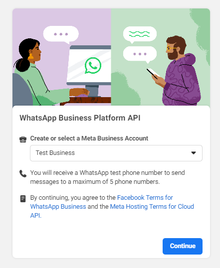
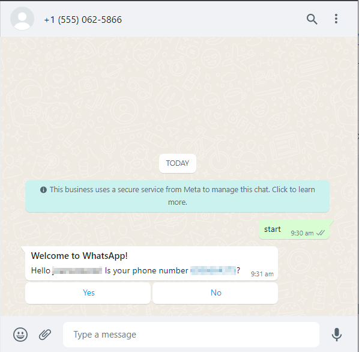
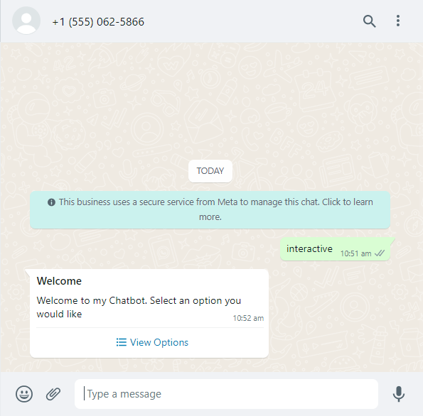

# Table of Contents

- [Table of Contents](#table-of-contents)
  - [Pre-requisites](#pre-requisites)
  - [Setting up your WhatsApp Chatbot](#setting-up-your-whatsapp-chatbot)
    - [Step 1: Create the App](#step-1-create-the-app)
    - [Step 2: Add WhatsApp to the App](#step-2-add-whatsapp-to-the-app)
    - [Step 3: Setting up the webhooks](#step-3-setting-up-the-webhooks)
    - [Aside: What happens during webhook connection?](#aside-what-happens-during-webhook-connection)
    - [Step 4: Handling Webhook Events](#step-4-handling-webhook-events)
    - [Step 5: Responding to the webhook](#step-5-responding-to-the-webhook)
    - [Step 6: Using Message Templates](#step-6-using-message-templates)
      - [Use case 1: Quick Replies](#use-case-1-quick-replies)
      - [Use case 2: Call to Action](#use-case-2-call-to-action)
      - [Use case 3: Dynamic variables](#use-case-3-dynamic-variables)
      - [Creating a message template](#creating-a-message-template)
    - [Step 7: Handling the template](#step-7-handling-the-template)
    - [Interactive messages](#interactive-messages)
      - [List messages](#list-messages)
      - [Reply buttons](#reply-buttons)
  - [Identifying Users](#identifying-users)
  - [Limitations](#limitations)

## Pre-requisites

To setup a WhatsApp Chatbot, you must ensure that you have:

1. a WhatsApp Business account
2. a WhatsApp Developer account

You can register for these at https://business.facebook.com and https://developers.facebook.com respectively.

## Setting up your WhatsApp Chatbot

### Step 1: Create the App

On https://developers.facebook.com, click on 'My Apps' at the top right hand corner of the screen. You will be redirected to the Apps page


If you do not have an existing chat bot, click on 'Create App'


Select the app type as 'business'


Fill in the appropriate details


Click Create App and your application has been created!

### Step 2: Add WhatsApp to the App

Now, you must add WhatsApp to the App. Do this by scrolling through the products and find WhatsApp, and click 'Set up'


You will be redirected to this page. Click on the Business you wish to link to, and press 'Continue'



You can now try sending in a test message by adding in your phone number, and clicking the 'Send Message' button


After clicking send message, you should receive such a message to your WhatsApp


Now we need to set-up webhooks to make use of the API.

### Step 3: Setting up the webhooks

In order to set up webhooks, on the left hand side, under 'WhatsApp', click onto Configuration


Click on 'edit'


Now fill in the following form


The callback URL will be to your backend Webhook controller, typically in the form of https://your-domain-here.com/webhook

Verify token refers to the unique key to authorize connection to the webhook. We now go through how Meta verifies and authorizes the webhook.

### Aside: What happens during webhook connection?

During verification, Meta will use the Callback URL as well as the Verify token you have passed in to do the following GET request

```bash
GET https://www.your-clever-domain-name.com/webhooks?
  hub.mode=subscribe&
  hub.challenge=1158201444&
  hub.verify_token={{YOUR_VERIFY_TOKEN}}
```

During this process, Meta expects the backend to:

1. Ensure that the provided `YOUR_VERIFY_TOKEN` is the same as the one in the backend
2. Return the same value provided in challenge

So an example response to the following request should be:

```bash
1158201444
```

If the response is not the same as the challenge number, the verification will fail and the webhook setup will fail.

An example method can be found in `webhook.controller`

```javascript
/**
   * Facebook will call this API to verify the webhook
   *
   * Learn more at https://developers.facebook.com/docs/graph-api/webhooks/getting-started#verification-requests
   * @param mode
   * @param challenge
   * @param token
   * @returns
   */
  @Get('/webhook')
  async verify(
    @Query('hub.mode') mode: String,
    @Query('hub.challenge') challenge: String,
    @Query('hub.verify_token') token: String,
  ) {
    if (mode && token) {
      if (mode === 'subscribe' && token === process.env.VERIFY_TOKEN) {
        console.log('WEBHOOK VERIFIED');
        return challenge;
      } else {
        throw new BadRequestException('VERIFICATION FAILED');
      }
    }
  }
```

### Step 4: Handling Webhook Events

After successfully setting up the webhook, we now need to handle the events sent by WhatsApp.

Setup an endpoint to `'POST /webhook'`, the following request is an example event sent by WhatsApp

```json
{
  "object": "whatsapp_business_account",
  "entry": [{
      "id": "WHATSAPP_BUSINESS_ACCOUNT_ID",
      "changes": [{
          "value": {
              "messaging_product": "whatsapp",
              "metadata": {
                  "display_phone_number": PHONE_NUMBER,
                  "phone_number_id": PHONE_NUMBER_ID
              },
              "contacts": [{
                  "profile": {
                    "name": "NAME"
                  },
                  "wa_id": PHONE_NUMBER
                }],
              "messages": [{
                  "from": PHONE_NUMBER,
                  "id": "wamid.ID",
                  "timestamp": TIMESTAMP,
                  "text": {
                    "body": "MESSAGE_BODY"
                  },
                  "type": "text"
                }]
          },
          "field": "messages"
        }]
  }]
}
```

More example payloads can be found at https://developers.facebook.com/docs/whatsapp/cloud-api/webhooks/payload-examples

Some important information we can pull from this event are:

1. Senders WhatsApp ID
2. Text message from the Sender
3. Time of message sent

We try responding to the message with an echo of the message sent to us as an example

### Step 5: Responding to the webhook

From the example request, we can pull out the following information:

```javascript
const sender_phone_number_id =
  req.body.entry[0].changes[0].value.metadata.phone_number_id;
const sender_phone_number =
  req.body.entry[0].changes[0].values.messages[0].from;
const sender_message =
  req.body.entry[0].changes[0].values.messages[0].text.body;
```

We send a response back to the sender. To do this, we use axios to make a POST request.

```javascript
await axios.post(
  `https://graph.facebook.com/v12.0/${phone_number_id}/messages?access_token=${process.env.TOKEN}`,
  {
    messaging_product: 'whatsapp',
    to: sender_phone_number,
    text: { body: `echo: ${sender_message}` },
  },
);
```

NOTE that access token here refers to the one shown in Step 2 image 3.

We now try sending a message to our text bot.


Our chat bot has successfully echoed!

### Step 6: Using Message Templates

Message templates can be useful if we want to incorporate **Quick Replies** or **Call to Action**. They can also be useful to have a fixed template to sending replies, and not needing to hard code everything in the backend. We go through some use cases for Message Templates

#### Use case 1: Quick Replies

**Quick replies** are the closest features to buttons in the WhatsApp Chatbot currently available.


The buttons with the text 'Start', 'Quit' and 'Lol' are the quick replies. By tapping on one, it will immediately reply with the button clicked


As seen, after clicking 'Lol', 'Lol' is immediately replied.

This can be useful if you want to give a list of available commands for users to choose from, and immediately invoke the command

#### Use case 2: Call to Action

**Call to Action** is also a button, used to either:

1. Call a specific phone number
2. Redirect to a URL.

Businesses can use this to redirect to their company websites, or to call their hotline


#### Use case 3: Dynamic variables

Message templates can have dynamic variables within them. So you can use them dynamically to fit the user. We will show more of this later.

#### Creating a message template

Creating a message template can be quite confusing in the beginning (because it is so hard to navigate to)

We navigate through the UI to create message templates together

1. Sign in to https://business.facebook.com, click the three line menu icon at the top left
   

2. Scroll down the menu till you see 'WhatsApp Manager' and click on it
   

3. Click on the three dots found at the top right of the card
   
   Click on 'Manage Message Templates'

4. Click on 'Create Message Template' to start creating a message template
   

You will be given options to create a Transactional, Marketing or a OTP. For now, we choose Transactional, and name it anything we like.

Note that we must also select a language. We will select English (UK)


5. We fill in the Header with a Text and body. For the body, we use the following to demonstrate dynamic variables
   

6. We add buttons at the bottom. We use **quick reply** to check if the information is correct
   

On the right hand side, it shows what our text message will look like


We click submit now. Lets edit our code to send this template and handle the responses.

### Step 7: Handling the template

We make use of the webhook handler to check if the message is 'start', if the message is start, we create the template and send it back

```javascript
const message = req.body.entry[0].changes[0].values.messages[0].text.body;
const sender_phone_number_id =
  req.body.entry[0].changes[0].value.metadata.phone_number_id;
const sender_phone_number =
  req.body.entry[0].changes[0].values.messages[0].from;
const sender_name = body.entry[0].changes[0].value.contacts[0].profile.name;

if (message === 'start') {
  await axios.post(
    `https://graph.facebook.com/v12.0/${phone_number_id}/messages?access_token=${process.env.TOKEN}`,
    {
      messaging_product: 'whatsapp',
      to: sender_phone_number,
      type: 'template',
      template: {
        name: 'testing_templates',
        language: {
          code: 'en_GB',
        },
        components: [
          {
            type: 'body',
            parameters: [
              {
                type: 'text',
                text: sender_name,
              },
              {
                type: 'text',
                text: sender_phone_number,
              },
            ],
          },
        ],
      },
    },
  );
}
```

We see that after we send start, the message has filled up with the correct information



**Differentiating between button reply vs normal text reply**

A reply to a button will have a different payload compared to a normal text

```json
// This is nested within entry[0].value.messages[0]
// Normal text
{
  "from": '...',
  "id": 'wamid.HBgKNjU4NjY2NDM3NRUCABIYFDNFQjBDNUE2RTlBMDhBMzI4ODM4AA==',
  "timestamp": '1658108791',
  "text": [Object],
  "type": 'text'
}

// Button reply
{
  "context": [Object],
  "from": '6586664375',
  "id": 'wamid.HBgKNjU4NjY2NDM3NRUCABIYFDNFQjAzOUJDQ0Q3NEU5OUI1NDMxAA==',
  "timestamp": '1658108632',
  "type": 'button',
  "button": [Object]
}

// Button object
{ "payload": 'Yes', "text": 'Yes' }
```

We can see that button will have type 'button' instead of text, the button object will have a payload and text, which are likely the same. We can make use of this to differentiate between button replies and normal texts

### Interactive messages

Another way to send messages with buttons are interactive messages. We use the Message API to send these. The two types of messages are **list messages** and **reply buttons**

#### List messages

These messages can be used to list out options to choose from.

To create a list message, we need an interactive object, below is an example interactive object:

```javascript
const interactive = {
  type: 'list',
  header: {
    type: 'text',
    text: 'Welcome',
  },
  body: {
    text: 'Welcome to my Chatbot. Select an option you would like',
  },
  action: {
    button: 'View Options',
    sections: [
      {
        title: 'Account',
        rows: [
          {
            id: 'account-login',
            title: 'Login',
            description: 'Log into your account',
          },
          {
            id: 'account-forgot',
            title: 'Forgot your password',
          },
        ],
      },
      {
        title: 'Cart',
        rows: [
          {
            id: 'cart-view',
            title: 'View my cart',
          },
          {
            id: 'cart-checkout',
            title: 'Checkout',
          },
        ],
      },
    ],
  },
};

await axios.post(
  `https://graph.facebook.com/v12.0/${phone_number_id}/messages?access_token=${process.env.TOKEN}`,
  {
    messaging_product: 'whatsapp',
    to: from,
    type: 'interactive',
    interactive: interactive,
  },
);
```

This list message will send the following:




We can tell that the following response is from clicking an interactive message as the following webhook will be sent:

```json
// Example message from webhook
{
  "context": [Object],
  "from": '...',
  "id": 'wamid.HBgKNjU4NjY2NDM3NRUCABIYFDNFQjBDQTJBQzhDRkZCMjZGNkFCAA==',
  "timestamp": '1658112692',
  "type": 'interactive',
  "interactive": [Object]
}

// interactive object
{
  "type": 'list_reply',
  "list_reply": { id: 'account-forgot', title: 'Forgot your password' }
}
```

We can see that the list_reply id is the same the one we set in the code above. This is how we can handle the list replies

#### Reply buttons

These are similar to message templates, except that the response will be an interactive type response. This could be potentially better to use if we want to tie an ID to each button click.

```javascript
const interactive = {
  type: 'button',
  header: {
    type: 'text',
    text: 'Welcome',
  },
  body: {
    text: 'Welcome to my Chatbot. Select an option you would like',
  },
  action: {
    buttons: [
      {
        type: 'reply',
        reply: {
          id: 'button-login',
          title: 'Login',
        },
      },
      {
        type: 'reply',
        reply: {
          id: 'button-forgot-password',
          title: 'Forgot Password',
        },
      },
      {
        type: 'reply',
        reply: {
          id: 'button-help',
          title: 'Help',
        },
      },
    ],
  },
};

await axios.post(
  `https://graph.facebook.com/v12.0/${phone_number_id}/messages?access_token=${process.env.TOKEN}`,
  {
    messaging_product: 'whatsapp',
    to: from,
    type: 'interactive',
    interactive: interactive,
  },
);
```

This will send the following message:


The following is a sample response, similar to the list response

```javascript
// Message object
{
  context: [Object],
  from: '6586664375',
  id: 'wamid.HBgKNjU4NjY2NDM3NRUCABIYFDNFQjBBNTEwNzhFQjJEMTE0REFGAA==',
  timestamp: '1658113969',
  type: 'interactive',
  interactive: [Object]
}

// interactive object
{
  type: 'button_reply',
  button_reply: { id: 'button-login', title: 'Login' }
}
```

You can make use of the interactive buttons to create an entire message flow for your end users.

You can read more about interactive messages at https://developers.facebook.com/docs/whatsapp/guides/interactive-messages/

## Identifying Users

You can identify users in the payload sent

The following is a sample payload:

```json
{
  "object": "whatsapp_business_account",
  "entry": [{
      "id": "WHATSAPP_BUSINESS_ACCOUNT_ID",
      "changes": [{
          "value": {
              "messaging_product": "whatsapp",
              "metadata": {
                  "display_phone_number": PHONE_NUMBER,
                  "phone_number_id": PHONE_NUMBER_ID
              },
              "contacts": [{
                  "profile": {
                    "name": "NAME"
                  },
                  "wa_id": PHONE_NUMBER
                }],
              "messages": [{
                  "from": PHONE_NUMBER,
                  "id": "wamid.ID",
                  "timestamp": TIMESTAMP,
                  "text": {
                    "body": "MESSAGE_BODY"
                  },
                  "type": "text"
                }]
          },
          "field": "messages"
        }]
  }]
}
```

We can extract the WhatsApp ID of the end user through the metadata field, and retrieve their phone_number_id. We can then store this ID in our database to keep track of users

## Limitations

The WhatsApp chatbot, while being able to have interactions with users via Interactive Message Templates and Interactive Messages, is not as robust as Telegram bot capabilities

1. No datepicker
2. Cannot send location
3. UI/UX not as nice as Telegram
